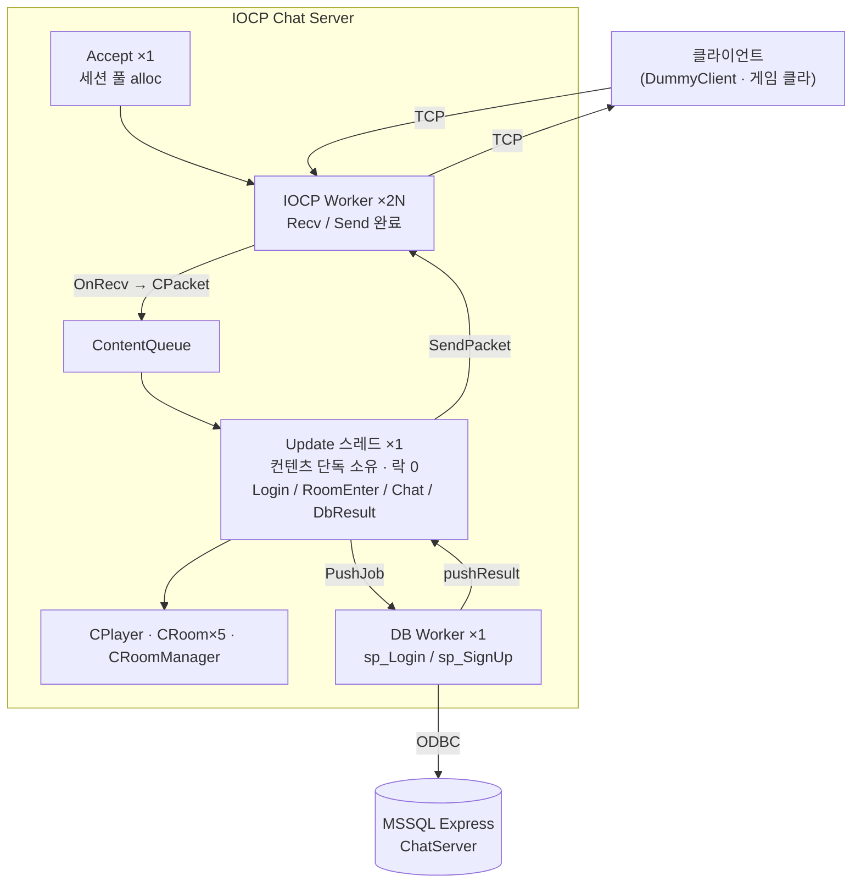
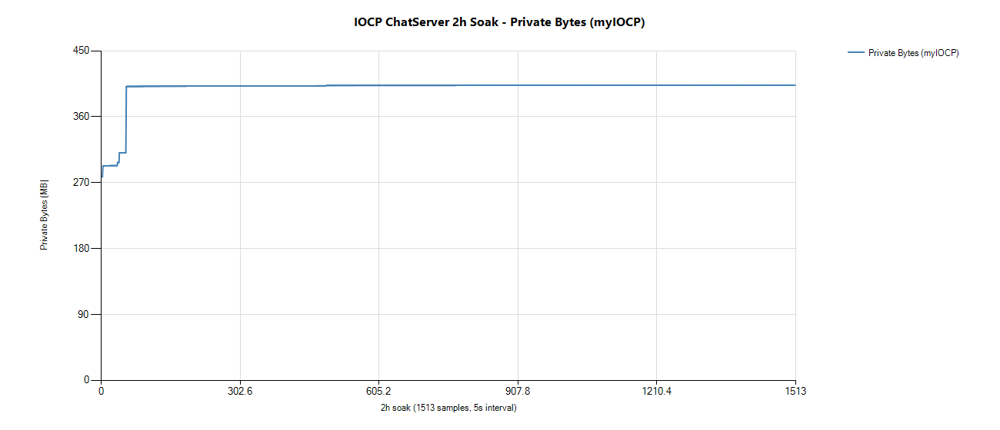
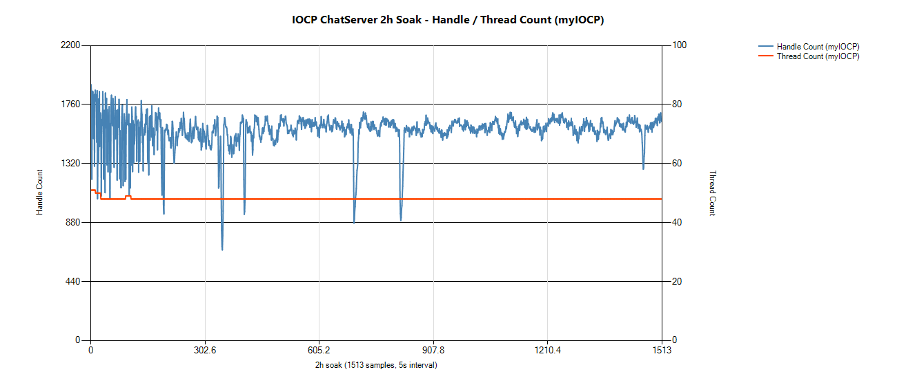

# IOCP Chat Server

> Windows **IOCP** 기반 멀티스레드 채팅 서버. Lock-Free 메모리 풀, MSSQL 비동기 연동, 패킷 암호화(AES-128-CTR + HMAC-SHA256)를 구현했습니다.


---

## 개요

- **기능** — 로그인/회원가입(DB), 방 입퇴장, 채팅 브로드캐스트.
- **IOCP 선택 이유** — 직전 프로젝트 [TCPFighter(select 기반 MMO)](https://github.com/yjj2123/tcpfighter-select-mmo)에서, 목표한 15,000 세션 규모에서는 select 의 폴링 비용이 지배적이 된다는 것을 측정으로 확인했습니다(Loop/sec 125,539 → 8,142). 소켓이 적을 때는 select 로도 충분하지만, 이 규모에서는 완료된 것만 통보받는 구조가 필요해 IOCP 로 전환했습니다.
- **디버깅 기록** — 멀티스레드 환경의 자원 생명주기(소유권·참조 카운트) 관련 버그 해결 과정을 [트러블슈팅](#트러블슈팅)에 정리했습니다.

---

## 아키텍처



> 상세 설계·시퀀스·프로토콜 = **[ARCHITECTURE.md](ARCHITECTURE.md)**

---

## 핵심 기능

| 영역 | 내용 |
|---|---|
| 네트워크 엔진 | IOCP 완료 포트, Accept 스레드 분리, WSARecv/WSASend, RingBuffer 송수신 |
| 컨텐츠 | 로그인·회원가입, 방(5개) 입퇴장, 채팅 브로드캐스트, 입퇴장 알림 |
| DB 연동 | ODBC + Stored Procedure, 별도 DB Worker 스레드로 **비동기화** |
| 보안 | 패킷 단위 **AES-128-CTR 암호화 + HMAC-SHA256 인증**(Encrypt-then-MAC) |

---

## 설계 결정

### 1. 컨텐츠 큐 단일화 — 컨텐츠 락 제거

IOCP 워커 여러 개가 `CPlayer`와 `CRoom`같은 객체를 동시에 건드리면 객체마다 락을 걸어야 합니다.
락이 늘어나면 락을 잡는 순서를 잘못 짤 여지도 같이 늘어나서,
접근 지점을 하나로 모으는 쪽을 택했습니다.

워커는 받은 패킷을 ContentQueue에 넣고 끝냅니다.
컨텐츠는 Update 스레드 하나가 전담하므로 보호할 대상이 없어집니다.

대신 Update가 코어 하나만 쓰게 됩니다.
채팅 트래픽에서는 이 정도로 충분하다는 것을 부하 테스트에서 확인했습니다.

### 2. DB 비동기화 — 채팅이 멈추지 않게

Stored Procedure 호출은 수십 ms 동안 블로킹됩니다.
Update가 직접 호출하면 그 사이 큐에 쌓인 채팅이 전부 대기하게 됩니다.

그래서 DB Worker 스레드를 따로 두고, Update는 Job만 넘기고 다음 메시지로 넘어가게 했습니다.
결과로 다시 큐를 통해 Update로 돌아옵니다.

### 3. Lock-Free Stack — ABA 문제 방지

패킷과 세션은 풀에서 꺼내 쓰고 반환하는데, 이 풀을 Lock-Free Stack으로 만들었습니다.

문제는 반환된 주소가 곧바로 재사용될 때입니다.
CAS는 주소만 비교하므로, 그사이 스택이 바뀌었어도 같은 주소면 성공해버립니다.

`Top`을 `[17bit stamp][47bit pointer]`로 묶고 Push·Pop마다 stamp를 올렸습니다.
같은 주소가 다시 올라와도 stamp가 달라져 있어 CAS가 실패합니다.

### 4. SessionID 16:48 비트 분할 — stale ID 차단

세션 슬롯을 재사용하면 이전 사용자 앞으로 온 패킷이 새 사용자에게 갈 수 있습니다.

SessionID를 `[상위 16bit 슬롯 인덱스][하위 48bit generation]`으로 나누고,
슬롯을 재사용할 때마다 generation을 올려 이런 패킷을 걸러냈습니다.

### 5. 패킷 암호화 (AES-128-CTR + HMAC-SHA256, EtM)

OpenSSL EVP API로 구현했습니다.
평문을 CTR 모드로 암호화한 다음, 헤더와 암호문 전체에 HMAC을 붙입니다.

순서를 Encrypt-then-MAC으로 잡은 이유는 수신 측 처리 때문입니다.
MAC을 먼저 검증하면 변조된 패킷은 복호화에 비용을 쓰기 전에 버릴 수 있습니다.

Nonce는 패킷마다 다르게 실어 키 재사용을 피했습니다.
DummyClient에 `--tamper` 옵션을 만들어 변조 패킷을 주입해봤고,
MAC 검증에서 걸려 폐기되는 것을 확인했습니다.

> 암호화 키는 학습용으로 코드에 하드코딩되어 있습니다. 운영 환경에서는 키 교환·외부 키 관리가 필요합니다.

---

## 트러블슈팅

> 디버깅 기록 전체 = **[BUGFIX_LOG.md](BUGFIX_LOG.md)** (19건). 대표 사례:

| 증상 | 원인 | 해결 |
|---|---|---|
| 브로드캐스트 중 크래시 | SendPacket 에러 경로에서 패킷을 **이중 Release** → 한 패킷을 여러 세션에 보내다 풀 반환 후 다른 세션이 접근 | 소유권을 호출자로 일원화, 에러 경로의 Release 제거 |
| 살아있어야 할 세션이 사라짐 | `ioRefCount=0` 시작 → WSASend가 PostRecv보다 먼저 완료되며 세션이 풀로 반환 → 반환된 세션 재사용 | `ioRefCount=1`로 시작, CloseSession에서 기본 참조 회수 |
| 부하 시 TPS=0 프리징 | FlushSend가 sendLock 없이 큐 접근 → `sqCount` 꼬임 → null 패킷 역참조 크래시 | 큐 조작 구간을 CriticalSection으로 보호 |
| 응답 누락 누적 후 정지 | SendQ 128 한계로 송신 큐 포화 | 512로 확장 + 진행 중 세션에 대한 패킷 race를 `closeFlag`로 사전 차단 |
| SendTPS=0 (전 세션 송신 실패) | 미초기화 메모리(0xCDCD…)가 SessionID로 → 인덱스 65535 범위 초과 | 구조체 선언부에 기본값 지정 |
| 끊긴 세션이 PlayerMap에 잔류 (누수) | PostRecv/FlushSend 즉시 실패 분기가 `IORelease`만 하고 `CloseSession` 누락 → `OnClientLeave` 미호출 | 두 분기에 `CloseSession` 추가 |

위 사례의 공통점은 "처리 중인 자원을 누가, 언제 반환하는가"입니다. 멀티스레드 환경에서 소유권과 참조 카운트 라이프사이클을 정리하는 과정이었습니다.

> 마지막 누수 사례는 수정 후 **2시간 · 51만 사이클 연속 부하에서도 재발하지 않음을 측정으로 확인**했습니다 → [evidence/LEAK_VERIFICATION.md](evidence/LEAK_VERIFICATION.md)

---

## 성능 / 안정성 검증

### 처리량
| 단계 | 환경 | 결과 |
|---|---|---|
| 컨텐츠 부하 | DummyClient 500봇 / 동시세션 ~1,700* / 5분 | 51,927 cycle · SendTPS 38K · **Err 0** |
| 큐 보강 후 | 고속 버스트 트래픽 | 50만 패킷/초 · 11만 cycle 무사고 |
| DB 통합 | 로그인 반복 부하 | 7,050+ Login OK · Fail 0 · Err 0 · Queue 0 |

`*` graceful close 지연으로 누적된 세션 포함합니다. loopback 측정이라 처리량 수치는 환경 의존적입니다.

### 메모리 / 리소스 누수 (2시간 연속 부하)
동접 ~1,000(피크 1,500) + 접속·해제 반복 + 변조 트래픽에서 **2시간 · 51만 번 접속·해제** 동안 끊김 없이 부하를 유지했습니다.

누수는 짧은 실행으로는 드러나지 않습니다. 그래서 2시간 동안 부하를 유지하면서 세 가지를 따로 관찰했습니다.

| 축 | 무엇을 | 판정 기준 |
|---|---|---|
| 서버 자체 카운터 | 접속·종료·정리 횟수의 차분 | 차분이 벌어지면 정리되지 않은 세션이 남은 것이므로, 차분 0 유지 |
| 성능 카운터 | Private Bytes · Handle · Thread (5초 간격 1,513 샘플) | 2시간 추세에 우상향이 없을 것 |
| Debug CRT 힙 | `_CrtMemDifference` 로 부하 전후 비교 | 잔존 할당이 사이클 수에 비례하지 않을 것 |



> 워밍업 4분(278 → 403MB) 이후 정상상태 2시간 동안 401.4 – 403.1MB. 변동폭 0.4%입니다.



> Handle / Thread. 2시간 동안 우상향 추세가 없습니다.

| 측정 | 결과 |
|---|---|
| 카운터 차분 (51만 사이클) | **0** |
| Private Bytes (정상상태 2h) | 변동 0.4%, 우상향 없음 |
| Handle / Thread | 우상향 없음 |
| CRT 힙 델타 (51만 사이클) | **0.012%**, 사이클 비례 아님 |
| 에러 | **0건** |

> 정상상태에서도 0.4% 정도의 미세한 증가는 있습니다. 동접 피크(1,500)에서 세션 풀이
> 한 번씩 늘어난 뒤 반환되지 않은 것으로, 접속·해제 횟수에 비례하는 증가는 아닙니다.
> CRT 힙 델타가 사이클 수에 비례하지 않는 것으로 함께 확인했습니다.

> 측정 과정 · 원본 데이터 · 한계 = **[evidence/LEAK_VERIFICATION.md](evidence/LEAK_VERIFICATION.md)**

---

## 빌드 & 실행

**요구 사항**: Visual Studio 2022, MSSQL Express 2019, ODBC Driver 17 for SQL Server, OpenSSL(libcrypto)

```text
1. DB 준비   : myIOCP/db/01-schema.sql 실행 (Users 테이블 + sp_Login / sp_SignUp)
2. 서버 빌드 : myIOCP.sln 열기 → Debug|x64 빌드 → 실행
3. 부하 테스트: DummyClient 실행 (--auto 옵션으로 봇 N개 접속)
```

> ODBC 연결 문자열·스키마 상세 = [ARCHITECTURE.md §6~7](ARCHITECTURE.md)

---

## 프로젝트 구조

```
iocp-chatserver/
├── README.md              ← 이 문서 (진입점)
├── ARCHITECTURE.md        ← 상세 설계·시퀀스·프로토콜
├── BUGFIX_LOG.md          ← 디버깅 기록 19건
├── evidence/              ← 누수 검증 (2시간 연속 부하 그래프 · CRT 힙 델타)
├── myIOCP/                ← 서버 본체
│   ├── CLanServer.*       ← IOCP 네트워크 엔진
│   ├── CLockFreeStack.h   ← ABA 방지 풀
│   ├── CRingBuffer.*      ← 송수신 링버퍼
│   ├── CPacket.*          ← 패킷 직렬화 + AES/HMAC
│   ├── CChatServer.*      ← 컨텐츠(로그인·룸·채팅)
│   ├── CRoom* / CPlayer.* ← 룸/플레이어
│   ├── CDBConnector/Worker← ODBC 비동기 DB
│   └── db/01-schema.sql   ← 스키마 + Stored Procedure
└── DummyClient/           ← 부하 테스트 클라이언트
```

---

## 기술 스택

`C++17` · `Windows IOCP` · `Winsock2` · `멀티스레드` · `Lock-Free` · `MSSQL` · `ODBC` · `Stored Procedure` · `OpenSSL(AES-CTR/HMAC-SHA256)`
